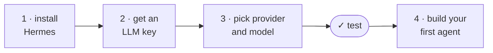

# Workshop Guide: Build Your First Daily Intelligence Agent

This is the thin setup path for the 45-minute LinuxFest workshop. For full
Hermes documentation, use the official docs:
<https://hermes-agent.nousresearch.com/docs>

## Success criteria

Core workshop target:

- [ ] Hermes installed
- [ ] One model/provider connected
- [ ] Local CLI test works
- [ ] One Daily Intelligence Report skill bootstrapped for something you actually care about

Cron, gateway delivery, PDF, Telegram, Discord, and email are stretch goals.
They are useful next steps, but they are not required to succeed in 45 minutes.

The whole path, in order:



## 1) Install Hermes

Follow the Official Hermes install guide: <https://hermes-agent.nousresearch.com/docs/getting-started/installation>

Default command-line install path for Linux, macOS, and WSL2:

```bash
curl -fsSL https://hermes-agent.nousresearch.com/install.sh | bash
```

### Setup Guide
1) Choose **full setup**, the Nouse Portal quick setup will require a credit card
2) Model provider: **Open Router** for your 
3) Model: openrouter/owl-alpha
4) Terminal backend: local
5) Platform: Setup now if you wish, be warned you may run out of time. 
6) Tools: Use the default set
7) Browser provider: Local


Prefer a clone? `git clone https://github.com/NousResearch/hermes-agent && cd hermes-agent && bash scripts/install.sh`


## 2) LLM Inference - Get Your API Key Ready

Start by making sure you have one working LLM path ready to power your agent.
Do this before the workshop if you can; provider login is the part most likely
to be slowed down by conference wifi.

### Easiest path if you do not already have a subscription: OpenRouter

OpenRouter usually has free model endpoints available:
<https://openrouter.ai/collections/free-models>.

As of *June 11*, [Owl Alpha](https://openrouter.ai/openrouter/owl-alpha),
followed by [NVIDIA: Nemotron 3 Ultra (free)](https://openrouter.ai/nvidia/nemotron-3-ultra-550b-a55b:free),
are the best free OpenRouter models to try for this workshop.

**Free as in beer, not free as in private.** OpenRouter's free tier is enough
for initial setup, but free requests may be used for provider training/evals.
OpenRouter currently advertises limited free usage, and a single complex agent
task can burn 5-20+ model requests. If you like the workflow, putting a small
amount of credit on OpenRouter is the simplest hosted path.

### Subscriptions You May Already Have that Work With Hermes

Run `hermes model` and pick the provider you already have. Current Hermes docs
list these common subscription/OAuth-friendly paths:

- **ChatGPT ($20 and up plans):** choose OpenAI Codex. Uses
  ChatGPT/Codex OAuth. Good workshop path if your account has Codex.
- **GitHub Copilot paid plans:** choose GitHub Copilot. Uses OAuth/device-code
  flow, `COPILOT_GITHUB_TOKEN`, `GH_TOKEN`, or `gh auth token`. If you already
  have the local Copilot CLI installed and tested, Hermes also supports the
  advanced GitHub Copilot ACP path via `copilot --acp --stdio`.
- **Claude Max plans ($100 and up plans):** choose Anthropic. Hermes docs describe Claude Max OAuth with
  extra usage credits, plus Anthropic API-key setup. This is not the same thing
  as a Claude Code SDK subscription path.
- **Google/Gemini accounts:** choose Google Gemini OAuth. Browser PKCE login;
  docs note free-tier support. Gemini API keys also work.
- **Grok paid plans:** choose xAI Grok OAuth. Browser login; useful if
  you already pay for Grok.
- **Qwen accounts:** choose Qwen OAuth. Browser PKCE login.
- **MiniMax accounts:** choose MiniMax OAuth. Browser PKCE login.
- **Nous Portal subscriptions:** choose Nous Portal, or run
  `hermes setup --portal` for one-shot OAuth setup.

If none of those applies, use OpenRouter for the session. Do not spend workshop
time fighting a local model or an enterprise cloud account unless it was already
prepared and smoke-tested.

### Local Open Weights models (not recommended during the session)
Local models are not reccomended for this session. Links below provided for your use later, since I am sure you will want to learn about running your own models.

At time of writing, [Qwen 3.6](https://unsloth.ai/docs/models/qwen3.6) and [Gemma 4 12B](https://unsloth.ai/docs/models/gemma-4) are the reasonable choices for local models for running an agent that fit on common consumer hardware.


## 3) Configure Provider and Model

Use the interactive model/provider picker:

```bash
hermes model
```

## Test Hermes works

Run a local cli chat

```bash
hermes --tui
```

### See What Your Agent Can Do
Check what tool and skills your agent has out of the box. Hermes comes packed. It's a good idea to come back later disable things you wont ever use. Infact, you can just chat with hermes about this.

```bash
hermes tools list --platform cli

hermes skills list
```

## 4) Choose Your Use Case

The default path is the **Daily Intelligence Agent**. If you are unsure, choose
that one. It works on any laptop, does not require production access, and matches
the main workshop promise: make Hermes read the stuff you already read every
morning, cross-reference it against your world, and bubble up what matters.

The workshop paths:

1. **Recommended default:** [Daily Intelligence Agent](../examples/prompts/daily-intelligence-agent.md)
   - For morning reports over news, tools, releases, CVEs, newsletters, events,
     metrics, or other sources you care about.
   - This is the path we will elaborate on below, with exact prompts to paste.

The alternatives are general guides, not scripts — each gives you the pattern, the
ingredients of a good prompt, and links to the official docs. You drive:

2. [Homelab / Production Health Agent](../examples/prompts/homelab-health.md)
   - For read-only summaries of machines, services, disk, memory, logs, or app
     health.

3. [Incident Triage Agent](../examples/prompts/alert-triage.md)
   - For turning alert webhooks into human triage summaries.

4. [ChatOps Over Your Data](../examples/prompts/chatops-data.md)
   - For asking questions over approved local docs, CSVs, SQLite databases,
     metrics exports, or team knowledge.

## Start the default path: Daily Intelligence Agent

Open the project page on GitHub and copy the kickoff prompt from it:

[examples/prompts/daily-intelligence-agent.md](../examples/prompts/daily-intelligence-agent.md)

The kickoff prompt tells Hermes to fetch the template skill straight from this
repo, install it locally, and bootstrap it: Hermes interviews you (four short
questions), then **edits the skill itself** so it watches your sources and knows
your world. The template ships with the instructor's real daily-newsletter setup
filled in as the example; the bootstrap replaces it with yours.

The template skill, if you want to read it first:

[examples/skills/daily-intelligence-report/SKILL.md](../examples/skills/daily-intelligence-report/SKILL.md)

The project page also contains:

- the kickoff prompt to paste into your interactive Hermes session
- a feedback prompt for improving the skill after the first report
- example builds for software news, CVEs, personal briefings, production monitoring, and support/business reports
- trust and safety notes
- optional cron/delivery stretch steps

If you are unsure what to build, pick this path. It works on any laptop and does
not require production access.

## Other Setup Pointers (Do after workshop)


- Gateway/delivery: `hermes gateway setup`, then configure Telegram, Discord, Slack, email, or another target.
  Docs: <https://hermes-agent.nousresearch.com/docs/user-guide/messaging>
- Ask hermes to setup a cron
  Docs: <https://hermes-agent.nousresearch.com/docs/user-guide/features/cron>
- Daily briefing example: official tutorial for the fuller automated version:
  <https://hermes-agent.nousresearch.com/docs/guides/daily-briefing-bot>
- PDF: save a clean Markdown report first; PDF formatting is a later/evening help topic.
- Docker/container isolation: useful for a more isolated setup later
  Docs: <https://hermes-agent.nousresearch.com/docs/user-guide/docker>
