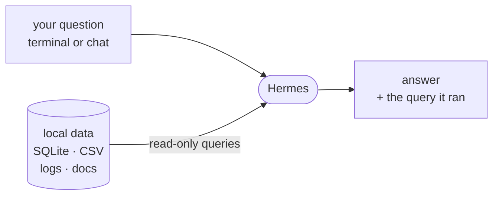

# WIP: ChatOps Over Your Data

*WIP: This is untested*

An alternative workshop path. Unlike the [default path](daily-intelligence-agent.md),
this one is a pattern you drive yourself, not a script we walk through together.

**Watches:** your local data — CSV files, a SQLite database, markdown docs, log files.
**Delivers:** plain-language answers to your questions, backed by the actual data and
the query it ran.
**Posture:** read-only. It queries and summarizes; it never writes to your data.

The goal is to automate the *asking* — the part where you'd otherwise hand-write a
`SELECT`, grep a CSV, or scroll a log to answer a one-off question.

## Build it: the four ingredients

Point Hermes at one dataset and ask real questions. Frame the session in your own words,
with four parts:

1. **Name the data.** Path and shape: "`./data/sales.sqlite` — inspect the schema
   first," or "`./logs/access.log` — parse, don't modify." Define terms once so it
   doesn't guess: "revenue means `amount_cents / 100` for non-refunded orders."
2. **The read-only rule.** "Read-only queries only — never write, alter, or drop.
   Touch nothing outside `./data/`."
3. **Show the work.** "Print the exact query or the files you used with every answer."
4. **The honesty rule.** "If the data can't answer the question, say exactly what's
   missing — don't approximate."

Then just ask: top products last month, errors per hour yesterday, what changed since
the last export. Read the queries it shows you — that's your audit trail.

## Grow it

Only after the interactive version earns trust:

- **A scheduled digest.** Ask Hermes to create a daily cron job that reports yesterday's
  numbers against the trailing average and flags big moves. Verify with
  `hermes cron list`. Docs: <https://hermes-agent.nousresearch.com/docs/user-guide/features/cron>
- **Questions from chat.** The gateway lets you (or your team) ask from Telegram,
  Discord, or Slack. Docs: <https://hermes-agent.nousresearch.com/docs/user-guide/messaging>
- **Make it a skill.** Save the data description, definitions, and rules as a skill so
  every session starts knowing your data.
  Docs: <https://hermes-agent.nousresearch.com/docs/user-guide/features/skills>

## Safety notes

- **Open a copy if it's precious.** Point the agent at a copy or read-only replica so a
  mistake can't matter.
- **It shows its work for a reason.** The query on every answer is your defense against
  confident-but-wrong. Read it.
- **Mind what's in the data.** CSVs and logs can carry PII or secrets — make the
  delivery target as private as the data.
- **Inspect the boundary:** `hermes tools list --platform cli` — confirm it can only
  read the paths this task needs.

## What "done" looks like

A read-only assistant over one real dataset that answers plain-language questions,
shows the query behind each answer, and refuses to guess when the data can't answer.
