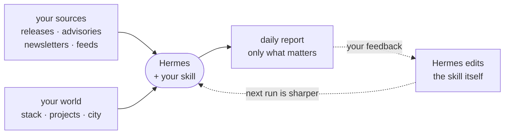

# Daily Intelligence Agent: the default workshop project

**Watches:** the stuff you already check every morning — release notes, advisories, feeds,
newsletters, dashboards, local events, whatever your morning tabs are.
**Delivers:** one short report that cross-references all of it against *your* world — your
stack, your machines, your projects, your plans — and bubbles up only what matters.




---

## The real version this is based on

This isn't hypothetical. The instructor runs this pattern daily: one morning newsletter
that reads tool releases for the tools he actually uses (plus what people are saying about
them), the newsletters he already subscribes to, events around town worth attending,
business news that could touch his product, and local news that changes his plans, all
judged against for if he will care, delivered as one PDF.

The template skill you're about to install ships with that setup filled in as the example.
The bootstrap replaces it with *yours*.

---

## Step 1: the kickoff prompt (paste into Hermes)
`
```text
Set up my Daily Intelligence Report skill.

1. Fetch this skill template:
   https://raw.githubusercontent.com/chrishart0/linuxfest-hermes-workshop/main/examples/skills/daily-intelligence-report/SKILL.md
2. Install it as a new skill named daily-intelligence-report in your own skills
   directory, using your skill management tooling. Do not hardcode paths.
3. The template is not customized yet. Follow its "Bootstrap" section exactly:
   interview me briefly, then edit the skill so it is mine.
4. Stay read-only. Do not set up cron, gateway, PDF, or any delivery yet.
```

Hermes will ask you four questions.

When the bootstrap finishes, Hermes offers you a first-run message. Send it. That's your
first report, give it a few minutes; Hermes is actually reading your sources.

### Example use cases

- **Tool & release watch:** 
  - sources: GitHub release feeds + project blogs for tools you run + x.com / reddit commentary
  - context: your actual installed versions
  - filter: breaking changes, deprecations, security fixes, major feature releases
- **CVE relevance for a real stack:** 
  - sources: NVD/distro advisory feeds; 
  - context: "Debian 12, nginx, PostgreSQL 16, Docker, OpenSSH"
  - filter: anything you'd patch this week.
- **Personal daily briefing:** 
  - sources: newsletters you already read, local event listings, your notes/calendar export
  - context: your city, interests, this week's commitments
  - filter: changes my plans or touches a current project.
- **Production monitoring report:** 
  - sources: read-only metrics/logs/analytics exports
  - context: current deploys and known issues
  - filter: user-facing symptoms and anomalies. (Only with safe read-only access you already have.)
- **Support & business signals:** 
  - sources: exported support/feedback data, key metrics
  - world: your product and current release
  - filter: new problem patterns, odd numbers.
  (Use exports/copies — never paste customer data into prompts.)

---

## Step 2: improve it with feedback (run two)

**Feedback required:** Self-improvement starts with feedback. After the first report, tell Hermes what you actually cared about, what you don't want to see again, and why.

```text
Feedback on today's report: <e.g. 'the kernel CVE was the only useful item; the three
AI-hype items were noise; rank security above releases; add the Tailscale changelog as a
source; too long — cap at 250 words'>

Update my daily-intelligence-report skill with this feedback. Keep it read-only and
source-required. Tell me in one line what you changed.
```

Hermes edits the skill itself. Sources, what you are about, noise rules, format. Do this
after every run for the first few days. It gets sharp fast.

---

## Stretch: schedule and deliver (after it's worth reading)

### 1) Setup your messaging *gateway* of choice (Discord, telegram, email, etc)
*~5-30 minute project*
<https://hermes-agent.nousresearch.com/docs/user-guide/messaging/>


### 2) Schedule your report to get delivered to you
Instruct Hermes to setup a cron to run your report research on a schedule.

Prompt
```text
Schedule my daily-intelligence-report for 8am daily delivery.
```