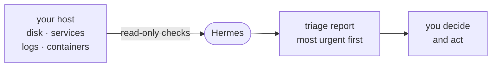

# WIP: Homelab / Production Health Agent

*WIP: This is untested*

An alternative workshop path. Unlike the [default path](daily-intelligence-agent.md),
this one is a pattern you drive yourself, not a script we walk through together.

**Watches:** disk, memory, services, logs, containers, backups — whatever you check by hand.
**Delivers:** a short triage: what needs attention, most urgent first.
**Posture:** read-only. It looks and tells you. It changes nothing.

The goal is to automate the *reading* — the part where a human squints at `df -h`,
`journalctl`, and `docker ps` at 2am and decides whether to care.

## Build it: the four ingredients

Write the prompt in your own words — Hermes doesn't need exact phrasing. A good
health-check prompt has four parts:

1. **What to inspect.** The things you'd check by hand, named for *your* machine:
   disk usage, failed systemd units, recent journal errors, container states, the last
   backup result. "The expected services are `nginx`, `postgresql`, and `tailscaled`."
2. **What's worth reporting.** Your thresholds and expectations: "flag any filesystem
   over 85%," "any unit not active," "anything OOM-killed since yesterday."
3. **The read-only rule.** "Inspect, but change nothing. No writes, no restarts, no sudo."
4. **The output shape.** "Only what needs attention, most urgent first. If everything
   is healthy, say so in one line."

Run it interactively first and read the output. Tighten ingredients 1 and 2 until the
report matches what you would actually want to see at 2am — usually two or three rounds.

## Grow it

Only after you trust the interactive version:

- **Schedule it.** Ask Hermes to create an hourly read-only cron job from your final
  prompt, then verify with `hermes cron list` and trigger one run to check the output.
  Docs: <https://hermes-agent.nousresearch.com/docs/user-guide/features/cron>
- **Deliver it where you already look.** The gateway posts to Telegram, Discord, Slack,
  email, and more. Docs: <https://hermes-agent.nousresearch.com/docs/user-guide/messaging>
- **Make it a skill.** If the prompt has grown long, ask Hermes to save it as a skill —
  the same self-editing pattern the default path uses.
  Docs: <https://hermes-agent.nousresearch.com/docs/user-guide/features/skills>

## Safety notes

- **Read-only until proven.** Keep "change nothing" in the prompt until you have a
  specific, narrow, reversible write in mind — and even then, log it.
- **No `sudo` by default.** If a check needs elevated reads, grant the narrowest access,
  not blanket root.
- **Inspect the boundary:** `hermes tools list --platform cli` — confirm the agent can
  only do what this task needs.
- **No secrets in the prompt.** Reference paths and unit names, never credentials.

## What "done" looks like

A read-only health agent on a schedule, delivering a real triage (not raw command
output) to a file or chat — and quiet when everything is fine.
