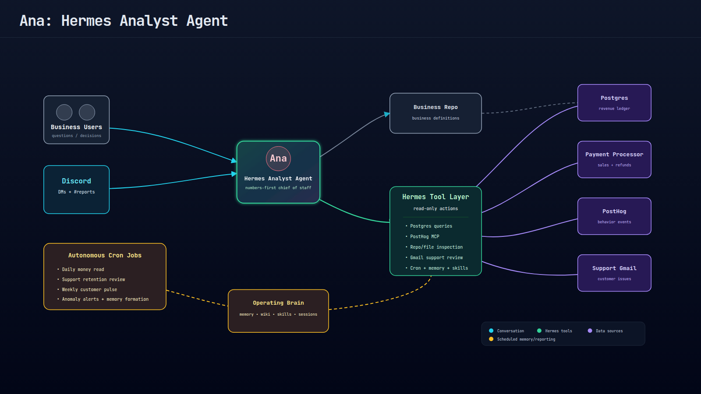

<!--
SPEAKER NOTE (deck-wide):
45-minute slot, Saturday 10:00 AM. Audience is terminal-first, open-source, self-hosting.
Lead with respect for their existing skills. The agent is a new tool on the shelf next to
cron, ssh, and grep — not a replacement for thinking. Demos carry the talk; slides are scaffolding.
-->

<!-- _paginate: false -->
<!-- _class: lead -->
<!-- _footer: '' -->

# Build Your Own **Useful Agents**

github.com/chrishart0/linuxfest-hermes-workshop

<!--
OPENING (0:00). Keep slides light; talk over them.
Start with coding agents as the familiar proof point, then widen the frame: if agents can inspect repos, run tools, and iterate, what else can they do for the rest of your work?
-->

---

<!-- _class: lead -->

The question

# Coding agents are only the **first** obvious use case.

What happens when you point the same pattern at your servers, dashboards, newsletters, releases, inboxes, and calendar?

<!--
Suggested beat from docs/workshop-objective.md:
Agents can write code, inspect repos, run tests, and iterate. That use case is locked in. Today is about applying the same shape outside the editor.
-->

---

<!-- _class: lead -->

# This is not hypothetical

How I am using agents for business and personal use cases

<!--
Set up four quick examples. Do not over-explain yet; each gets its own slide.
The story is credibility and desire: this is already useful in real personal/business workflows.
-->

---

<!-- _class: lead -->

# Personal daily briefing

Tools, AI news, local events, business signals, and things worth acting on.

<!--
Talk track: one PDF / report that reads the sources you already check every morning and pulls out what matters.
Examples: tools/software news, newsletters/blogs, local events, business news, local news.
-->

---

<!-- _class: lead -->

# Ops Agent: Release Monitoring and Triage

<!--
This is the strongest emotional proof. Tell the live release story: the agent surfaced customer-impacting analytics issues quickly enough to squash bugs and draft apology/remediation emails.
-->

---

<!-- _class: lead -->

# Health

Personal health, blood work / labs, fitness tracker metrics

---

<!-- _class: lead -->

8:03 AM · team Discord · #reports

> $xxxx gross on 123 orders. Biggest movement: gross down 5% vs yesterday
> even though orders were up — AOV slipped. Refund flow down 2%.

8:10 PM  · team Discord · #reports

> @Founder serious customer-sat issue: support has 16 customer threads sitting 4h+ without a reply today, including 10 refund/cancel threads. That is the live leak.

Nobody on the team wrote this.

---

---

## Analyst agent: day one → today

- **Useful in ~3 hours.** Created in one evening; answering live revenue questions
- **Paid for itself on day one.** Flagged that the analytics dashboard was over-counting a KPI vs the database. 

> **Day-one Ana is roughly today's build:** a profile, a one-sentence job, read-only access to data, daily iterations via discord

<!--
All three facts came from interviewing Ana herself, who pulled them from session history.
This is the bridge slide — land the closing line hard: nobody in this room is 23 skills away from value; they are one evening away.

-->

---

## Hermes mental model

**Memory** helps Hermes *know you.*
**Skills** help Hermes *know how.*
**Cron** and **webhooks** tell Hermes *when to act.*
**Gateway** puts the result *where humans already are.*

<!--
You've already seen all four running — that's Ana.

Keep this four-line model intact everywhere. It is still the portable Hermes frame.
Connect it back to today's build: we start with a skill; cron/gateway are stretch layers.
Callback: Ana is all four lines at full size — memory = the business definitions and pitfalls, skills = her 23 custom workflows, cron = her 8 scheduled reports, gateway = Discord where the team lives.
-->

--- 

# Workshop guide

github.com/chrishart0/linuxfest-hermes-workshop/blob/master/docs/workshop-guide.md

## Checklist

✅ Setup your LLM Inference (Open Router, Codex, GitHub Copilot, Claude, ...)
✅ Install Hermes
✅ Configure Hermes with a model
✅ Test Hermes, say hi
✅ Follow `examples/prompts/daily-intelligence-agent.md` to setup your agent

### Stretch Goal

✅ Configure a gateway, hermes sends your repots and chats where you are (Discord, telegram, etc)
